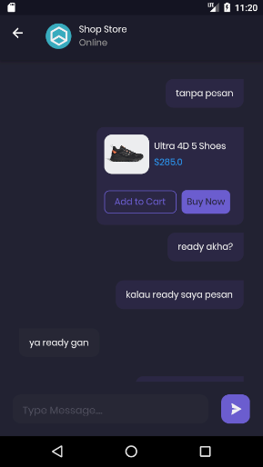

## About Laravel

Laravel is a web application framework with expressive, elegant syntax. We believe development must be an enjoyable and creative experience to be truly fulfilling. Laravel takes the pain out of development by easing common tasks used in many web projects

## About BWA-Shamo
BWA-Shamo is a mobile app e-commerce build by flutter and laravel for backend, reference by course from build with angga
https://buildwithangga.com/kelas/full-stack-laravel-flutter-2021-building-e-commerce-and-chat-apps?thumbnail=xif3qNStbJ.127&main_leads=browse

## screen shoots
 &nbsp;
 &nbsp;
 &nbsp;
 &nbsp;
